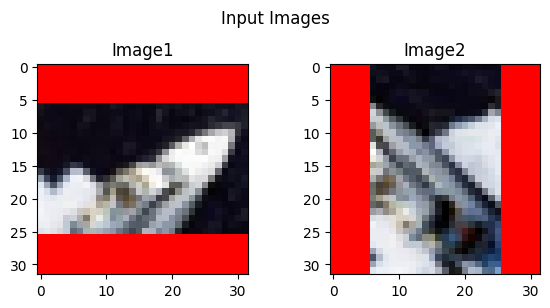
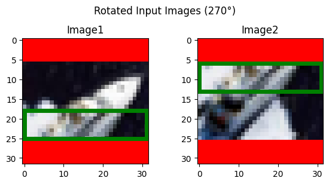
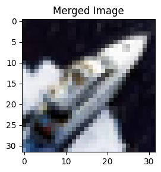
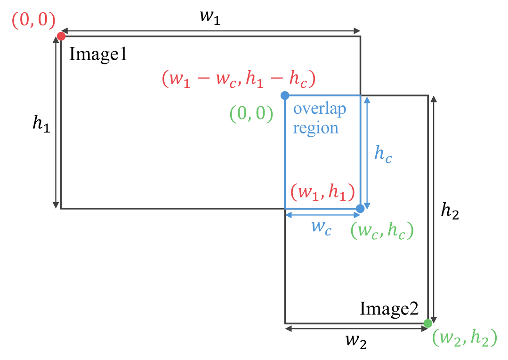
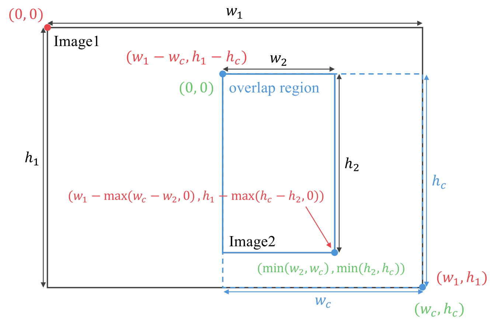

# image-stitcher
This is a python implementation for stitching images by automatically searching for overlap region.
- [👨‍💻 Usage](#-usage)
- [🎯 Preview of results](#-preview-of-results)
- [🧠 Main Idea](#-main-idea)
- [🙋‍♂️ Support](#️-support)
- [✉️ Contact](#️-contact)

## 👨‍💻 Usage
```python
from src.main import main
from src.utils.visualizer import result_visualize

merged_image, cand = main(
    image1=image1,       # The first image to be combined
    image2=image2,       # The second image to be combined
    min_overlap=(5, 5),  # The minimum overlap region
    verbose=False,       # Whether to print the log
)
result_visualize(
    image1=image1,              # The first image to be combined
    image2=image2,              # The second image to be combined
    merged_image=merged_image,  # The output image
    cand=cand,                  # The parameters
)
```


## 🎯 Preview of results
The results using [`CIFAR-10`](https://www.cs.toronto.edu/~kriz/cifar.html) are shown below. I would refer you to [`tutorial.ipynb`](https://github.com/C-Naoki/image-stitcher/blob/main/notebooks/tutorial.ipynb) for detailed results.

<p align="center">

<br><br>
<b>Figure 1.</b> The example of input images. The red area represents an empty region. This application can combine these images while considering their rotation.
</p>

<p align="center">

<br><br>
<b>Figure 2.</b> The preprocessed input images. This rotation process is necessary to accurately combine the images. The green frame represents the overlap region between the input images.
</p>

<p align="center">

<br><br>
<b>Figure 3.</b> The output image.
</p>

## 🧠 Main Idea
<p align="center">

<br><br>
<b>Figure 4.</b> The overview of this application in limited case.
</p>

This application is designed based on the overlap region's width $w_c$ and height $h_c$. Thanks to this idea, we can simply limit the search space, thus preventing it from capturing overly small, suboptimal overlap region.

<p align="center">

<br><br>
<b>Figure 5.</b> The overview of this application.
</p>

However, the above approach is not always applicable, specifically when $\min(h_1, h_2) < h_c$ or $\min(w_1, w_2) < w_c$. To address this issue, I change the perspective of $w_c$ and $h_c$ like the above figure. Therefore, this application can handle images of arbitrary sizes.


## 🙋‍♂️ Support
💙 If you like this app, give it a ⭐ and share it with friends!

## ✉️ Contact
💥 For questions or issues, feel free to open an [issue](https://github.com/C-Naoki/image-stitcher/issues). I appreciate your feedback and look forward to hearing from you!
